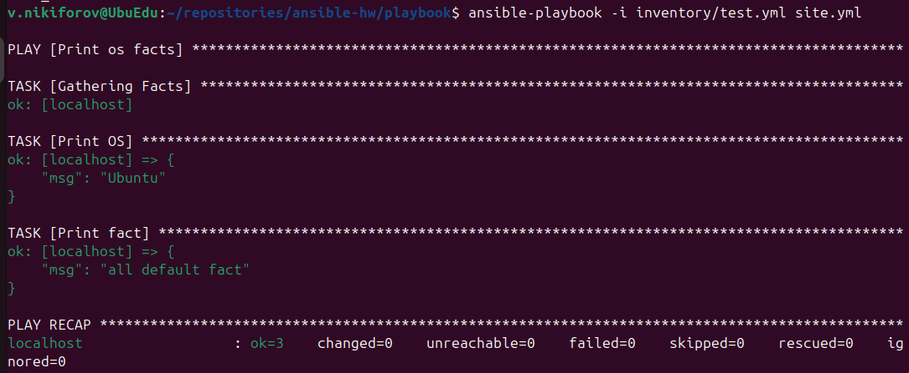
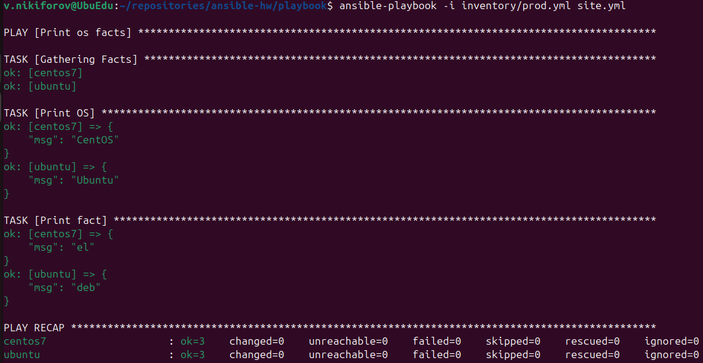
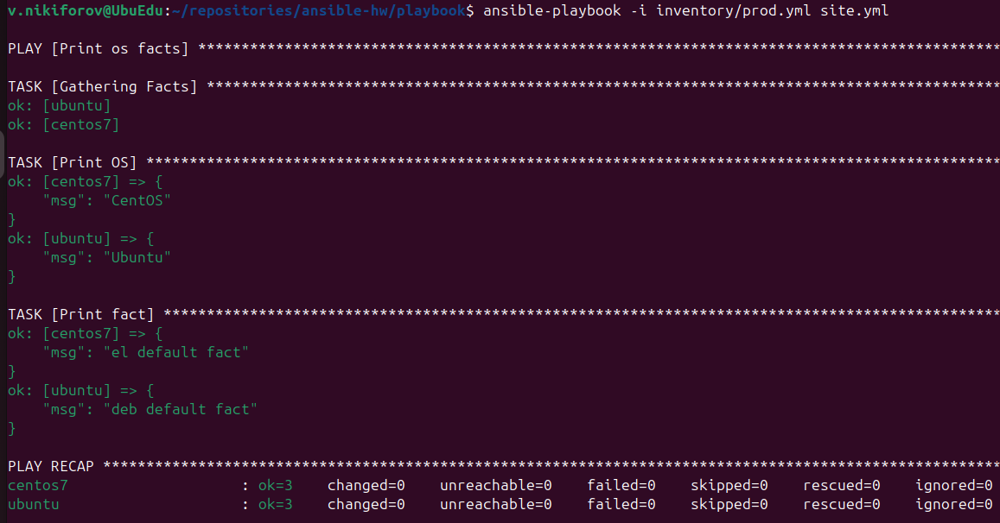
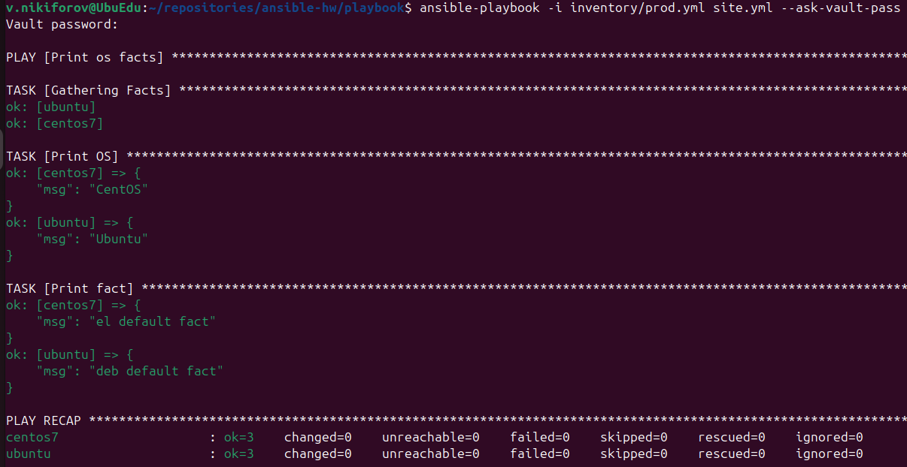
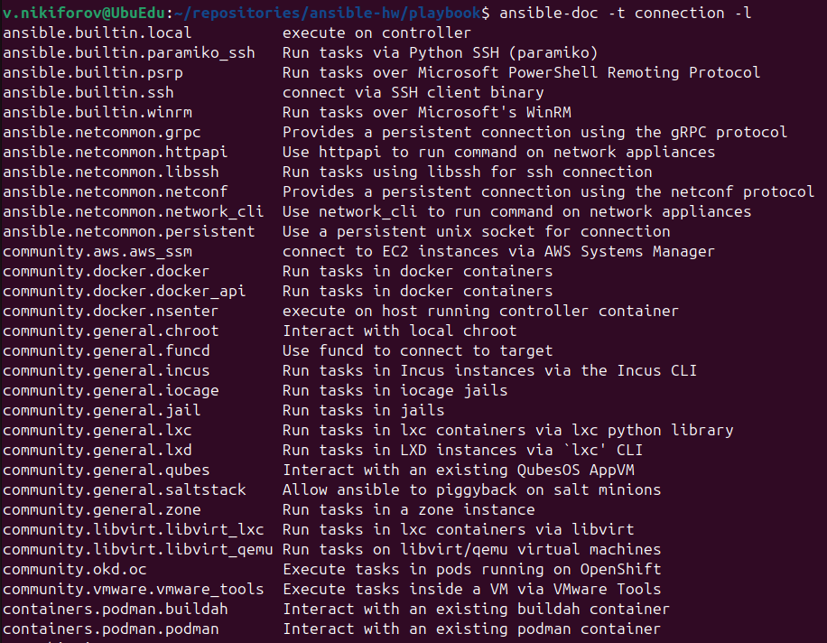
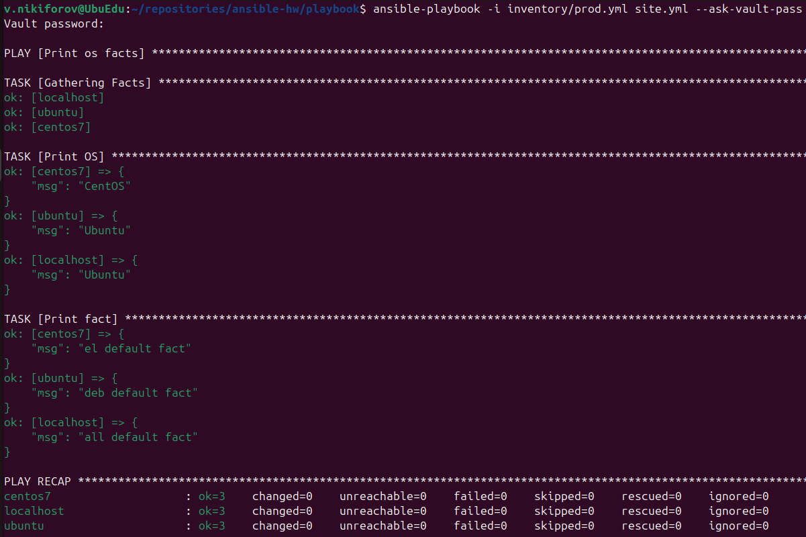

# Домашнее задание к занятию «Введение в Ansible»

## Цель работы

Изучить основы работы с Ansible, инвентарём, переменными, группами хостов, Ansible Vault и плагинами подключения.

---

# Задание 1

## Запуск playbook на окружении `test.yml`

Запуск выполнялся командой:

```bash
ansible-playbook -i inventory/test.yml site.yml
```

Первоначальное значение переменной `some_fact`:

```
12
```

---

# Задание 2

## Изменение значения переменной

Файл с переменной:

```
group_vars/all/examp.yml
```

Исходное значение:

```yaml
---
some_fact: 12
```

После изменения:

```yaml
---
some_fact: "all default fact"
```

Повторный запуск:

```bash
ansible-playbook -i inventory/test.yml site.yml
```

Результат:

```
all default fact
```

### Скриншот



---

# Задание 3

## Запуск playbook на окружении `prod.yml`

Запуск:

```bash
ansible-playbook -i inventory/prod.yml site.yml
```

Полученные значения:

| Хост | Значение `some_fact` |
|------|----------------------|
| ubuntu | `deb` |
| centos7 | `el` |

### Скриншот



---

# Задание 4

## Изменение переменных для групп

### `group_vars/deb/examp.yml`

```yaml
---
some_fact: "deb default fact"
```

### `group_vars/el/examp.yml`

```yaml
---
some_fact: "el default fact"
```

---

# Задание 5

## Повторный запуск playbook

Команда:

```bash
ansible-playbook -i inventory/prod.yml site.yml
```

Полученные значения:

| Хост | Значение `some_fact` |
|------|----------------------|
| ubuntu | `deb default fact` |
| centos7 | `el default fact` |

### Скриншот



---

# Задание 6

## Шифрование переменных с помощью Ansible Vault

Шифрование выполнено командами:

```bash
ansible-vault encrypt group_vars/deb/examp.yml
ansible-vault encrypt group_vars/el/examp.yml
```

Использованный пароль:

```
netology
```

Запуск playbook:

```bash
ansible-playbook -i inventory/prod.yml site.yml --ask-vault-pass
```

После ввода пароля playbook успешно выполнился.

### Скриншот



---

# Задание 7

## Просмотр списка connection plugins

Команда:

```bash
ansible-doc -t connection -l
```

Для выполнения задач непосредственно на управляющем узле (**Control Node**) используется плагин:

```
ansible.builtin.local
```

Причина выбора:

Плагин `local` позволяет выполнять задачи непосредственно на управляющем узле без использования SSH или других удалённых протоколов подключения.

### Скриншот



---

# Задание 8

## Добавление локального хоста

В файл `inventory/prod.yml` была добавлена группа:

```yaml
local:
  hosts:
    localhost:
      ansible_connection: local
```

После запуска:

```bash
ansible-playbook -i inventory/prod.yml site.yml --ask-vault-pass
```

получены следующие значения:

| Хост | Значение `some_fact` |
|------|----------------------|
| localhost | `all default fact` |
| ubuntu | `deb default fact` |
| centos7 | `el default fact` |

### Скриншот



---

# Ответы на вопросы

## 1. Какое значение имел `some_fact` при первом запуске?

```
12
```

---

## 2. В каком файле задавалось первоначальное значение?

```
group_vars/all/examp.yml
```

---

## 3. Какое значение было установлено после изменения?

```
all default fact
```

---

## 4. Какие значения получили группы после изменения?

| Группа | Значение |
|---------|-----------|
| deb | `deb default fact` |
| el | `el default fact` |

---

## 5. Каким паролем были зашифрованы файлы?

```
netology
```

---

## 6. Какой connection plugin подходит для работы на управляющем узле?

```
ansible.builtin.local
```

---

# Использованные команды

```bash
ansible-playbook -i inventory/test.yml site.yml

ansible-playbook -i inventory/prod.yml site.yml

ansible-playbook -i inventory/prod.yml site.yml --ask-vault-pass

ansible-vault encrypt group_vars/deb/examp.yml

ansible-vault encrypt group_vars/el/examp.yml

ansible-doc -t connection -l
```

---

# Структура каталога со скриншотами

```text
img/
├── examp.png
├── prod.png
├── prod_def.png
├── vault.png
├── plugin.png
├── localhost.png  
```
